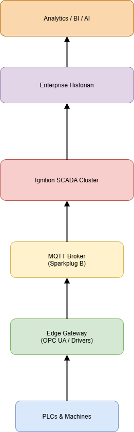
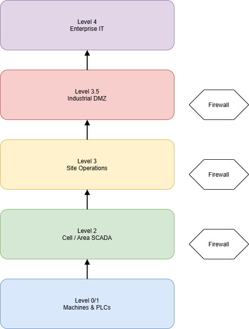

# SCADA Architecture & Engineering Standards

This repository is the source of truth for enterprise SCADA, IIoT, and dashboard architecture standards. It defines best practices, reference architectures, and implementation guides for scalable deployment across plants.

## 📌 Goals

- Standardize architecture across facilities
- Enable vendor and integrator alignment
- Ensure scalable, secure, and supportable deployments
- Provide clear implementation guidance (not just theory)

---

## 🏗️ Enterprise Reference Architecture

**Description:**
- PLCs connect to local Edge Gateways
- Data is published via MQTT with Sparkplug B
- Central Ignition clusters consume MQTT
- Data flows into historians and analytics platforms
- Dashboards follow standard template frameworks

See full details:  
➡ `docs/architecture/overview.md`

---

## 🌐 Plant Network Segmentation

**Zones:**
- Level 0/1: PLC and machine networks
- Level 2: Cell/Area SCADA
- Level 3: Site Operations
- Level 3.5: DMZ
- Level 4: Enterprise IT

See full details:  
➡ `docs/architecture/security-zones.md`

---

## 📁 Documentation Structure

| Area | Description |
|--------|------------|
| `docs/architecture` | Network, security, data flows |
| `docs/scada` | Ignition standards, templates, alarming |
| `docs/iiot` | MQTT, gateways, historian integration |
| `docs/how-to` | Step-by-step deployment guides |
| `docs/adr` | Architecture decision records |
| `diagrams/source` | Editable draw.io files |
| `diagrams/export` | Images used in documentation |

---

## ✍️ How to Update Diagrams (Draw.io)

1. Open diagram from:  
   `diagrams/source/*.drawio` using https://app.diagrams.net
2. Edit diagram
3. Export as **PNG or SVG**
4. Save to:  
   `diagrams/export/`
5. Commit **both source and export files**

This ensures diagrams are reviewable and reproducible.

---

## 🔁 Change Management

- All updates must be done via Pull Requests
- Architecture changes should include:
  - Diagram update (if applicable)
  - ADR record (for major decisions)

---

## 📐 Architecture Decision Records (ADR)

Major design choices must be recorded in `docs/adr/`.

Example:
- Why MQTT was selected over OPC tunneling
- Why Ignition Perspective is standard for mobile
- Why certain DMZ models are enforced

Template:  
➡ `templates/adr-template.md`

---

## 🚀 Publishing (Optional)

This repo can be published as a static site using:

- MkDocs
- GitHub Pages
- Azure DevOps Wiki pipelines

So plants and vendors can browse standards without Git access.

---

## 📞 Ownership

SCADA Architecture Team  
Lead: Jaideep Ayancha