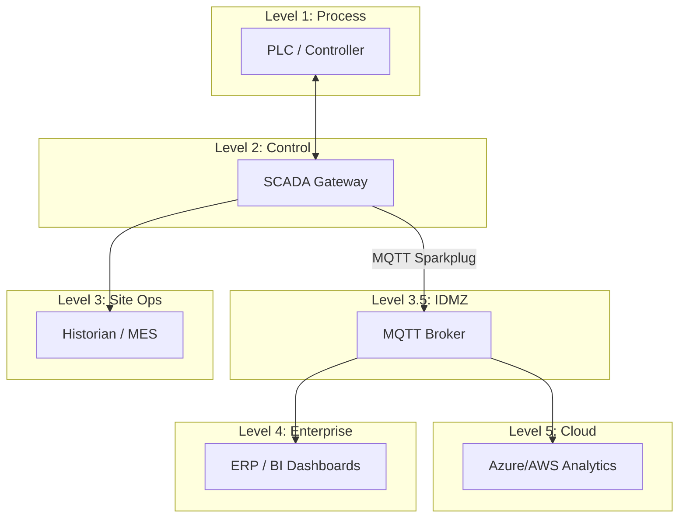

# OT Data Flow Standards

This document defines the standards for data movement across the OT network levels (Purdue Model) and into the enterprise cloud environments.

## Data Flow Architecture

OT data flows are designed to be **unidirectional (northbound)** whenever possible, ensuring that higher-security zones are protected from lower-security zones or external networks.

### 1. Level 1 to Level 2 (Local Control)
- **Protocol**: EtherNet/IP, Profinet, Modbus TCP, OPC UA.
- **Direction**: Bidirectional (Real-time control and monitoring).
- **Standard**: PLCs communicate with local HMIs and SCADA Gateways within the same Cell/Area zone.

### 2. Level 2 to Level 3 (Site Operations)
- **Protocol**: OPC UA, SQL, Ignition Remote Provider.
- **Direction**: Primary Northbound (Status/Alarms), Optional Southbound (Setpoint changes).
- **Standard**: Data is aggregated from local SCADA nodes into Site-wide Historians and MES systems.

### 3. Level 3 to Level 3.5 (Industrial DMZ)
- **Protocol**: MQTT Sparkplug B over TLS/SSL.
- **Direction**: Unidirectional Northbound.
- **Standard**: Edge Gateways publish data to MQTT Brokers located in the IDMZ. No direct connection is allowed from the plant floor to the enterprise network.

### 4. Level 3.5 to Level 4/5 (Enterprise & Cloud)
- **Protocol**: MQTT, HTTPS (REST API), AMQP.
- **Direction**: Unidirectional Northbound.
- **Standard**: Enterprise brokers or cloud ingestion services (Azure IoT Hub, AWS IoT Core) subscribe to topics from the IDMZ brokers.

---

## Data Flow Diagram (Conceptual)

## Security Requirements for Data Flows

1. **Protocol Isolation**: Use gateways/proxies to bridge different network segments; never route raw industrial protocols (e.g., EtherNet/IP) across the IDMZ.
2. **Encryption**: All data leaving Level 3 must be encrypted using TLS 1.2 or higher.
3. **Authentication**: Use certificate-based authentication for MQTT clients and service principals for cloud ingestion.
4. **Firewall Conduits**: Only specific, documented ports are allowed through firewalls (e.g., TCP 8883 for MQTTS).
