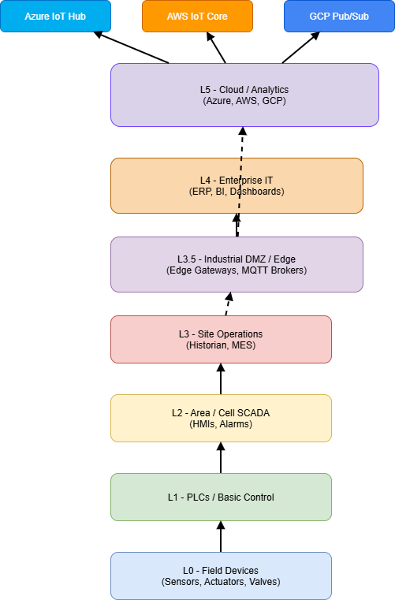

# Purdue Model for Industrial Automation

The Purdue Model is the **foundation of enterprise OT architecture**. It defines levels of control and IT systems, supporting deterministic operations, security zoning, and cloud integration.

---

## Levels Overview

| Purdue Level | Zone | Description |
|--------------|------|-------------|
| **L0 – Process** | Field Devices | Sensors, actuators, motors, valves |
| **L1 – Basic Control** | PLCs / Controllers | Real-time control loops, local logic |
| **L2 – Area / Cell** | HMIs, SCADA | Local monitoring, operator interfaces, alarming |
| **L3 – Site Operations** | Historian, MES | Data aggregation, reporting, manufacturing execution |
| **L3.5 – Industrial DMZ** | Edge & MQTT Brokers | Secure buffer between OT and IT, cloud ingestion |
| **L4 – Enterprise IT** | ERP, Business Apps | Planning, corporate reporting, dashboards |
| **L5 – Cloud / Analytics** | Azure, AWS, GCP | AI/ML, BI, remote monitoring, energy management |

---

## Network Segmentation Principles

- Each level is **segmented using VLANs and firewalls**.
- **Northbound traffic** flows through controlled conduits.
- **No direct access** from L4/L5 to L0/L1.
- Industrial DMZ (L3.5) is the **gateway for all cloud ingestion**.

---

## Edge & Cloud Integration

Edge gateways collect data from PLCs / SCADA and publish via **MQTT Sparkplug B** to:

- **Local brokers** in L3.5
- **Enterprise brokers** in L3
- **Cloud ingestion pipelines** (Azure IoT Hub, AWS IoT Core, GCP Pub/Sub)

This ensures:

- Store-and-forward during WAN outages
- Secure protocol isolation
- No direct cloud-to-PLC paths

---

## Security Principles

- Apply **Defense in Depth** at every level.
- Enforce **least privilege** on all accounts.
- Maintain **zone-based access controls**.
- Use **MFA for remote access** via DMZ jump hosts.
- Logging and monitoring for **all critical communications**.

---

## Diagram Notes

- Editable **Draw.io diagram** is located at:
